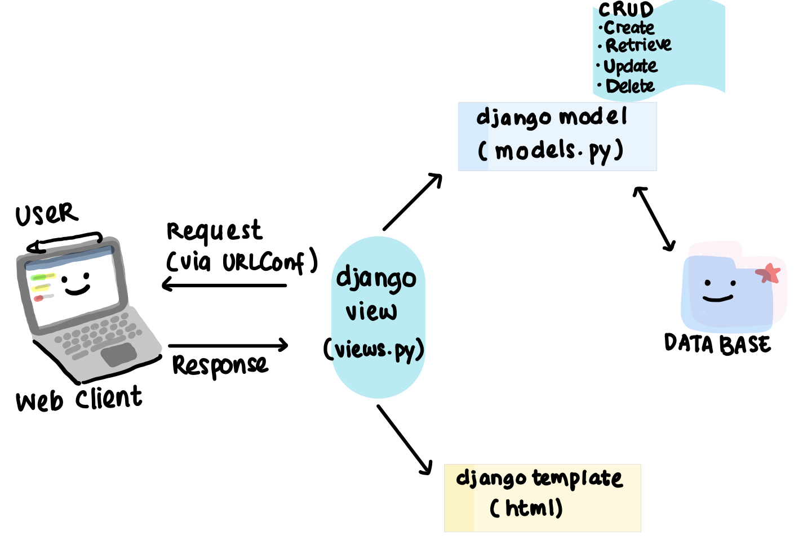

Nama    : Rana Koesumastuti

NPM     : 2206083496

Kelas   : PBP A

Link Adaptable: https://little-goblin-inventory.adaptable.app/main
Link PaaS PBP: http://rana-koesumastuti-tugas.pbp.cs.ui.ac.id/

PENJELASAN TUGAS 2 PBP 
1. Jelaskan bagaimana cara kamu mengimplementasikan checklist di atas secara step-by-step (bukan hanya sekadar mengikuti tutorial).
    A. Inisiasi, Pengaktifan Virtual Environment
    1. Membuat repositori lokal 
    2. melakukan inisiasi git di terminal perangkat dan melakukan konfigurasi akun github di terminal perangkat
    3. Membuat virtual environment dengan perintah ```python3 -m venv env``` kemudian mengaktifkannya dengan ```source env/bin/activate```
    4. Memasang dependencies yang diperlukan dan membuat proyek django dengan perintah:
        ```django-admin startproject nama_proyek .```
    
    B. Konfigurasi Proyek dan Menjalankan server
    1. Menambahkan ```"*"``` pada ```ALLOWED_HOST``` di ```settings.py``` yang artinya kita mengizinkan akses dari semua host, kemudian jalankan server Django dengan perintah:
        ```./manage.py runserver```
    3. Buka http://localhost:8000 untuk memeriksa keberhasilan pembuatan web 

    C. Mengunggah Proyek ke Repositori Github
    1. Membuat repositori Github baru dan mengatur visibilitasnya sebagai publik 
    2. Menambahkan berkas ```.gitignore``` (pada Mac perlu melalui IDE seperti VSC agar filenya tampak dan bisa di push ke repositori github)
    3. menghubungkan repositori lokal ke repositori github dan melakukan ```add```, ```commit```, ```push```

    E. Membuat Aplikasi main di proyek little_goblin_inventory
    1. Jalankan perintah berikut untuk membuat aplikasi baru berisi struktur awal. Pada direktori tersebut juga terdapat file-file seperti ```models.py```, ```views.py```, ```urls.py```, dsb.
        python manage.py startapp main
    2. Setiap kali kita ingin mendaftarkan aplikasi, kita dapat membuka berkas ```settings.py``` di dalam direktori proyek dan menambahkan nama aplikasi ke variabel ```INSTALLED_APPS```.

    F. Routing pada proyek
    1. Buka berkas ```urls.py``` di dalam direktori proyek dan impor fungsi ```include``` dari ```django.urls```.
    2. Tambahkan rute URL ```/main``` untuk mengarahkan ke tampilan main di dalam variabel ```urlpatterns```.
    3. Jalankan proyek Django dengan perintah ```python manage.py runserver```
    
    G. Membuat model
    1. Mengimpor models pada ```models.py``` di direktori aplikasi main
    2. Kemudian buatlah sebuah kelas dengan nama model yang diinginkan dan lengkapi kelas tersebut dengan atribut-atribut yang diperlukan serta tipe data atribut yang sesuai
    4. Jangan lupa untuk melakukan migrasi model tiap melakukan perubahan terhadap model

        ```python manage.py makemigrations``` untuk menciptakan perubahan model.

        ```python manage.py migrate```       untuk mengimplementasikan perubahan model tersebut.

    H. Membuat fungsi pada views.py
    1. Buka berkas ```views.py``` di folder main kemudian impor fungsi ```render```: ```from django.shortcuts import render``` yang berfungsi untuk me-render tampilan HTML 
    2. Membuat fungsi ```show_main``` di bawah impor yang akan menampilkan data yang ada dan mereturn 3 argumen yaitu request, "main.html", context :

        def show_main(request):
        context = {
            ...
        }

        return render(request, "main.html", context)

    I. Routing URL aplikasi main
    1. Membuat berkas ```urls.py``` di direktori ```main``` dan mengisi berkas dengan kode berikut: 
    
        from django.urls import path //mendefinisikan pola URL
        from main.views import show_main //memanggil fungsi show_main

        app_name = 'main'

        urlpatterns = [ //variabel urlpatterns berupa list 
            path('', show_main, name='show_main'),      // parameter fungsi path, terdapat fungsi show_main yang diimpor 
        ]
    
    J. Deployment App
    1. Membuat akun adaptable dan menghubungkannya dengan seluruh repositori github kita
    2. Memilih repositori yang akan dideploy, repositori saya ```little_goblin_inventory```
    3. Memilih template app ```Python``` dan tipe basis data ```PostgreSQL```  
    4. Menyesuaikan tipe python, tipe saya adalah 3.10.6 
    5. Memasukkan start command ```python manage.py migrate && gunicorn nama_repositori.wsgi```
    6. Masukkan nama aplikasi dan centang bagian HTTP Listener on PORT
    7. Click deploy App


2. Buatlah bagan yang berisi request client ke web aplikasi berbasis Django beserta responnya dan jelaskan pada bagan tersebut kaitan antara urls.py, views.py, models.py, dan berkas html.


    

    atau

    

    ```urls.py```:
    - file yang mengatur routing atau pola URL untuk aplikasi kita.
    - Sebuah URL akan digunakan user untuk mengakses dan berinteraksi dengan aplikasi. URL akan didefinisikan seperti '/items/' yang akan mengarahkan ke 'view'
    
    ```views.py```:   
    - file berisi fungsi-fungsi yang menangani permintaan dari pengguna (request) dan mengembalikan respons (response).
    - Fungsi di dalam views.py berisi logika untuk memproses permintaan dan berinteraksi dengan model jika diperlukan.
    - Terdapat fungsi seperti show_items yang akan mengambil data dari model "Item" dan mengirimkannya ke berkas HTML untuk ditampilkan.

    ```models.py```:
    - file yang mendefinisikan model atau struktur data yang akan digunakan oleh aplikasi.
    - Pada kasus ini, kita mendefinisikan model "Item" dengan atribut-atributnya seperti "name," "amount," dan "description."
    - Model ini akan digunakan untuk berinteraksi dengan basis data dan menyimpan data item.
    Berbagai Template HTML:

    ```Template HTML```: 
    - file untuk mengatur tampilan atau halaman web yang akan ditunjukkan kepada pengguna.
    - Di dalam template, kita dapat menggunakan sintaks Django untuk memasukkan data dari view ke dalam HTML.

    Urutan proses request dan reponse:
    1. Pengguna mengakses alamat domain atau IP pada browser mereka.
    2. Browser membuat HTTP Request yang dikirim ke server yang sesuai.
    3. Server menerima request dan memprosesnya.
    4. Jika request sesuai dengan aturan yang telah diatur, server meneruskan request ke aplikasi Django.
    5. Aplikasi Django mengevaluasi URL yang diterima.
    6. URL akan dicocokkan dengan pola yang didefinisikan di file ```urls.py```.
    7. Jika terjadi kecocokan URL, itu artinya pengguna meminta resource tertentu yang dihandle oleh sebuah ```view```.
        ```View``` adalah fungsi yang menjalankan tugas tertentu, seperti mengambil data dari basis data atau mengisi template HTML.
    Contoh: Sebuah HTML template yang mungkin diisi dengan data dari basis data berada di view. Setelahnya, halaman HTML yang sudah jadi akan dikirimkan kembali ke pengguna.

3. Jelaskan mengapa kita menggunakan virtual environment? Apakah kita tetap dapat membuat aplikasi web berbasis Django tanpa menggunakan virtual environment?
    Virtual environment digunakan untuk mengisolasi lingkungan pengembangan proyek Python sehingga kita dapat menginstal paket(package) dan mengatur dependensi proyek secara terpisah. Hal ini bertujuan menghindari konflik antara proyek yang berbeda. Tentunya kita dapat membuat web Django tanpa virtual environment, tetapi disarankan sebagai best practice untuk menjaga kebersihan dan isolasi proyek.

4. Jelaskan apakah itu MVC, MVT, MVVM dan perbedaan dari ketiganya.
   

    MVC, MVT, dan MVVM adalah 3 desain arsitektur di pengembangan perangkat lunak yang populer.

    - MVC (Model-View-Controller): Desain arsitektur yang memisahkan aplikasi menjadi tiga komponen utama: Model (logika aplikasi dan data), View (tampilan UI), dan Controller (manajemen interaksi antara Model dan View).

    - MVT (Model-View-Template): Konsep yang mirip dengan MVC dalam Django, dengan Model (data dan logika), View (logika pengolahan data), dan Template (tampilan UI).

    - MVVM (Model-View-ViewModel): Konsep yang digunakan dalam pengembangan aplikasi berbasis web, di mana ViewModel memisahkan Model dan View, memungkinkan pengikatan data yang lebih kuat.

    Perbedaan utama antara ketiganya adalah bagaimana mereka mengatur dan memisahkan komponen aplikasi, serta cara mereka mengelola aliran data antara Model, View, dan Controller/Template/ViewModel. MVP dan MVT menggunakan komponen mediator antara 'model' dan 'view' yaitu 'controller' atau 'presenter'. MVC adalah desain paling sederhana. Sedangkan MVP dan MVVM lebih fleksibel dan memungkinkan operasi lebih bersih terkait isu antara lapisan berbeda dari aplikasi. Django menggunakan pendekatan MVT yang mirip dengan MVC.


PENJELASAN TUGAS PBP 3
- Apa perbedaan antara form POST dan form GET dalam Django?
    Perbedaan antara POST dan GET dalam django adalah cara keduanya menyimpan data.

    

    1. POST adalah metode pengiriman data dari formulir HTML ke server yang lebih aman karena data tidak terlihat di URL dan lebih cocok untuk mengirim data sensitif atau besar seperti file gambar. Data dikirim melalui badan permintaan HTTP dan tidak tersimpan dalam cache peramban web.
    2. GET adalah metode di mana data dikirim melalui URL dan dapat terlihat oleh siapa saja yang melihat URL. Ini cocok untuk permintaan yang bisa di-bookmark atau dibagikan dengan mudah, tetapi tidak cocok untuk data sensitif atau besar. Data GET bisa disimpan dalam cache peramban web.

- Apa perbedaan utama antara XML, JSON, dan HTML dalam konteks pengiriman data?
    - XML (eXtensible Markup Language) adalah format yang fleksibel dengan tag hierarkis yang kompleks, dinamis, dan case sensitive karna berkaitan dengan transportasi data. Pengiriman data lebih lambat daripada JSON karena data diekstrak dari tags. Meskipun demikian, XML dinilai lebih aman daripada JSON. 

    - JSON (JavaScript Object Notation) adalah format data yang lebih ringkas dengan struktur objek sederhana mirip JavaScript. JSON mengirimkan data lebih cepat dan data didefinisikan jelas sebagai object dan value. Selain itu penulisan sintaks lebih mudah dan kode yang dihasilkan lebih sedikit daripada XML.

    - HTML (HyperText Markup Language) adalah bahasa markup untuk membuat halaman web. HTML bersifat statis karena itu terkait dengan tampilan data dan case insensitive. Data akan tersimpan di dalam HTML ketika HTML digunakan untuk menampilkan data. 

- Mengapa JSON sering digunakan dalam pertukaran data antara aplikasi web modern?
    JSON sering digunakan dalam aplikasi web modern karena ringkas, mudah dibaca, terintegrasi dengan JavaScript, cepat di-parse, dan didukung di server dan klien.

- Jelaskan bagaimana cara kamu mengimplementasikan checklist di atas secara step-by-step (bukan hanya sekadar mengikuti tutorial).
    A. LANGKAH AWAL: ROUTING
    1. Sebelum membuat input form, kita akan melakukan routing dari ```/main``` ke ```/``` dan membuat kerangka views dari situs web kita.
    2. Membuat berkas ```base.html``` pada root folder dan menjadikannya sebagai berkas template 

    B. MEMBUAT FORM INPUT DATA
    1. pada direktori ```main``` buatlah berkas baru ```forms.py``` dan isi dengan suatu kelas yang berisi model dan fields yang diperlukan
    2. Melakukan import yang diperlukan pada ```views.py``` dan membuat suatu fungsi yang menerima parameter ```request``` dengan tambahan beberapa kode seperti:

    ```form = ProductForm(request.POST or None)```, ```form.is_valid()```, ```form.save()```, ```return HttpResponseRedirect(reverse('main:show_main'))```. 

    Sehingga form dapat menambahkan data produk secara otomatis ketika sebuah data di-submit dari form.

    3. Memodifikasi kode pada fungsi ```show_main``` dengan ```Product.objects.all()``` agar seluruh objek Product yang tersimpan di database dapat terambil. 

    4. Mengimpor fungsi yang kita buat pada langkah 2 dan 3 di ```urls.py``` pada folder ```main``` dan juga menambahkan path url ke dalam ```urlpatterns```

    5. Buat file pada direktori main/templates ```create_product.html```  dan ```main.html``` (memodifikasi yang sudah ada) yang meng-extend ```base.html``` dengan potongan kode untuk menampilkan produk dalam bentuk tabel dan tombol yang bisa mengarahkan ke halaman lain.

    C. MENAMPILKAN DATA DALAM BENTUK LAIN
    UNTUK SETIAP TIPE DATA YANG DITAMPILKAN, LAKUKAN LANGKAH BERIKUT:
    1. Buka views.py yang ada pada folder main dan tambahkan import HttpResponse dan Serializer pada bagian paling atas.
    2. Buatlah sebuah fungsi yang menerima parameter request dengan nama show_jenisFormat (seperti show_xml, show_json, dsb) dan buatlah sebuah variabel di dalam fungsi tersebut yang menyimpan hasil query dari seluruh data yang ada pada Model.
    3. Tambahkan return function berupa HttpResponse yang berisi parameter data hasil query yang sudah diserialisasi menjadi jenis format yang digunakan dan parameter content_type="application/jenisFormat".

            Berikut adalah contoh fungsi view pada jenis format tanpa id:
            ```
            def show_jenisFormat(request):
                data = namaModel.objects.all()
                return HttpResponse(serializers.serialize("jenisFormat", data), content_type="application/jenisFormat")
            ```

            Berikut adalah contoh fungsi view pada jenis format dengan id:
            ```
            def show_jenisFormat_by_id(request, id):
                data = namaModel.objects.filter(pk=id)
                return HttpResponse(serializers.serialize("jenisFormat", data), content_type="application/jenisFormat")
            ```

    4. Tambahkan path url ke dalam urlpatterns untuk mengakses fungsi yang sudah diimpor tadi.

            ...
            path('jenisFormat/', show_jenisFormat, name='show_jenisFormat'), 
            ...
    5. Lakukan langkah ini sesuai dengan jenis format yang digunakan

- SCREEN SHOT POST MAN 
1. HTML
    

2. XML
    

3. XML BY ID
    

4. JSON
    

5. JSON BY ID
    

6. TAMPILAN HTML
    


PENJELASAN TUGAS PBP 4
1. Django UserCreationForm adalah salah satu bentuk form yang disediakan oleh framework Django untuk memudahkan pembuatan formulir pendaftaran pengguna (user registration). Form ini digunakan untuk mengumpulkan data yang diperlukan saat pengguna mendaftar, seperti nama pengguna (username) dan kata sandi (password). Kelebihan dari Django UserCreationForm adalah sebagai berikut:
   - Memiliki validasi bawaan untuk memastikan data yang dimasukkan oleh pengguna sesuai dengan aturan yang ditentukan.
   - Memudahkan pengembang web dalam membuat halaman pendaftaran pengguna dengan cepat dan efisien.
   - Terintegrasi dengan sistem otentikasi Django, sehingga pengguna yang terdaftar dapat masuk ke aplikasi dengan mudah.
   - Dapat disesuaikan (customized) sesuai dengan kebutuhan proyek.

   Kelemahan dari Django UserCreationForm adalah keterbatasannya dalam hal penyesuaian (customization). Jika proyek kita memerlukan fitur pendaftaran pengguna yang sangat khusus, mungkin kita perlu membuat formulir pendaftaran sendiri yang lebih kompleks.

2. Dalam konteks Django:
   - Autentikasi adalah proses memverifikasi identitas seorang pengguna. Ini melibatkan penggunaan nama pengguna (username) dan kata sandi (password) untuk memastikan bahwa pengguna adalah orang yang mereka klaim.
   - Otorisasi adalah proses memverifikasi apa yang dapat diakses oleh pengguna setelah mereka terautentikasi. Ini berkaitan dengan hak akses dan izin pengguna terhadap berbagai bagian dari aplikasi web.

   Keduanya penting dalam aplikasi web karena:
   - Autentikasi memastikan bahwa hanya pengguna yang sah yang dapat mengakses aplikasi dengan hak akses yang sesuai.
   - Otorisasi mengendalikan apa yang dapat dilihat dan dilakukan oleh pengguna setelah mereka terautentikasi, sehingga menjaga keamanan dan privasi data.

3. Cookies dalam konteks aplikasi web adalah berkas teks yang disimpan pada komputer pengguna dan digunakan untuk menyimpan informasi sesi atau preferensi pengguna. Django menggunakan cookies untuk mengelola data sesi pengguna dengan menyimpan informasi seperti ID sesi, preferensi bahasa, atau data lain yang perlu diingat selama interaksi dengan aplikasi. Ini membantu aplikasi web menjaga keadaan sesi pengguna dari satu permintaan ke permintaan berikutnya.

   Django memiliki dukungan bawaan untuk mengelola cookies melalui modul `django.contrib.sessions.middleware.SessionMiddleware`. Modul ini memungkinkan pengembang untuk menyimpan dan mengambil data sesi pengguna dengan mudah.

4. Penggunaan cookies pada umumnya aman dalam pengembangan web, terutama jika digunakan sesuai dengan praktik terbaik. Namun, ada beberapa risiko potensial yang harus diwaspadai:

   - **Cookies Sniffing**: Meskipun data pada cookies biasanya dienkripsi, jika koneksi pengguna tidak aman (misalnya, melalui HTTP daripada HTTPS), data pada cookies dapat disadap oleh pihak yang tidak berwenang.

   - **Cookies Poisoning**: Ini terjadi ketika data pada cookies dimodifikasi oleh pihak yang tidak berwenang. Hal ini dapat mengakibatkan masalah keamanan dan kerentanan terhadap serangan.

   - **Cookies Theft**: Cookies yang disimpan pada komputer pengguna dapat dicuri jika komputer tersebut tidak aman. Oleh karena itu, penting untuk menyimpan informasi sensitif dalam cookies dengan bijak dan menggunakan metode enkripsi jika diperlukan.

   - **Cookies Tracking**: Beberapa pihak dapat menggunakan cookies untuk melacak aktivitas pengguna secara online. Ini dapat menjadi masalah privasi jika tidak diatur dengan baik.

Untuk mengatasi potensi risiko ini, penting untuk menggunakan HTTPS untuk mengenkripsi lalu lintas data, menghindari menyimpan data sensitif dalam cookies, dan mengimplementasikan praktik keamanan lainnya dalam pengembangan web kita.

5. Jelaskan bagaimana cara kamu mengimplementasikan checklist di atas secara step-by-step (bukan hanya sekadar mengikuti tutorial).
    A. Membuat Fungsi Registrasi, Login, dan Logout 
    [FUNGSI REGISTRASI]
    1. Setelah mengaktifkan vritual environment, impor modul yang diperlukan yaitu ```redirect```, ```UserCreationForm```. dan ```messages```
    2. Membuat suatu fungsi bernama ```register``` yang menerima parameter ```request``` untuk menghasilkan formulir registrasi secara otomatis dan menghasilkan akun pengguna ketika data di-submit dari form.
    3. Membuat berkas html baru pada folder templates di folder main berjudul ```register.html``` untuk mengatur tampilan registrasi pengguna 
    4. Pada berkas urls.py, impor fungsi yang tadi dibuat di ```views.py``` dan tambahkan path url pada urlpatterns untuk mengakses fungsi registrasi

    [FUNGSI LOG IN]
    1. Setelah mengaktifkan vritual environment, impor modul yang diperlukan yaitu ```authenticate, logout```
    2. Membuat suatu fungsi bernama ```login_user``` yang menerima parameter ```request```. Pada fungsi ini akan memanfaatkan ```request.POST.get()``` untuk mendapatkan username dan password user yang kemudian akan di autentikasi dengan pemanggilan ```authenticate(request, username=username, password=password)```
    3. Membuat berkas html baru pada folder templates di folder main berjudul ```login.html``` untuk mengatur tampilan registrasi pengguna 
    4. Pada berkas urls.py, impor fungsi yang tadi dibuat di ```views.py``` dan tambahkan path url pada urlpatterns untuk mengakses fungsi login

    [FUNGSI LOGOUT]
    1. Setelah mengaktifkan vritual environment, impor modul yang diperlukan yaitu ```authenticate, logout```
    2. Membuat suatu fungsi bernama ```logout_user``` yang menerima parameter ```request```. 
    3. Membuat berkas html baru pada folder templates di folder main berjudul ```logout.html``` untuk mengatur tampilan registrasi pengguna 
    4. Pada berkas urls.py, impor fungsi yang tadi dibuat di ```views.py``` dan tambahkan path url pada urlpatterns untuk mengakses fungsi logout

    B. Membuat dua akun dan 3 data dummy
    1. Aktifkan virtual environment terlebih dahulu dengan menjalankan perintah ```source env/bin/activate```
    2. Pada terminal lokal jalankan ```python3 manage.py runserver```
    3. Buka ```http://localhost:8000/```
    4. Pada halaman web buat akun pada halaman registrasi  dan klik submit
    5. Login kembali dengan username dan password yang telah dibuat
    6. Ketika sudah berhasil masuk, buat produk dengan memencet tombol ```Add Product```. Lakukan langkah ini sebanyak 3x
    7. Ulangi langkah 4-6 sekali lagi

        Berikut akun dan password yang telah saya buat:
        1. rana.koesumastuti, password: ayamjago
        2. leminerale, password: airminumya

    C. Menghubungkan Item dengan User
    1. untuk menghubungkan satu produk dengan satu user melalui sebuah relationship, buka models.py yang ada pada subdirektori main dan impor
        ```
        from django.contrib.auth.models import User
        ```
        dan menambahkan kode berikut pada class Item:
        ```
        user = models.ForeignKey(User, on_delete=models.CASCADE)
        ```
    2. Buka views.py yang ada pada subdirektori main, dan ubah potongan kode pada fungsi create_product menjadi sebagai berikut:

        def create_product(request):
        form = ProductForm(request.POST or None)

        if form.is_valid() and request.method == "POST":
            product = form.save(commit=False)
            product.user = request.user
            product.save()
            return HttpResponseRedirect(reverse('main:show_main'))
        ...

        commit=False digunakan untuk mencegah penyimpanan langsung ke database, memungkinkan modifikasi objek sebelum disimpan.
        Objek produk dihubungkan dengan pengguna yang sedang login melalui field user.

    3. Ubah fungsi show_main menjadi sebagai berikut.
        ```
        def show_main(request):
            products = Product.objects.filter(user=request.user)

            context = {
                'name': request.user.username,
            ...
        ...
        ```
        Produk yang terkait dengan pengguna yang sedang login diambil dari database.
        Username pengguna yang login ditampilkan di halaman utama.

        Seharusnya, akan muncul error saat melakukan migrasi model. Pilih 1 untuk menetapkan default value untuk field user pada semua row yang telah dibuat pada basis data.

    4. Migrations-1
        Jalankan ```python manage.py migrate```
        Ketik angka 1 lagi untuk menetapkan user dengan ID 1 (yang sudah kita buat sebelumnya) pada model yang sudah ada.

    5. Migrations-2
        Lakukan ```python manage.py migrate``` untuk mengaplikasikan migrasi yang dilakukan pada poin sebelumnya.
    
    D. Cookies
    1. Buka berkas views.py di subdirektori main dan tambahkan impor HttpResponseRedirect, reverse, dan datetime di bagian atas berkas.
    python
    2. Pada fungsi login_user, tambahkan kode untuk menambahkan cookie last_login untuk melacak waktu terakhir pengguna melakukan login. Gantilah blok kode jika pengguna tidak None dengan kode berikut:
        ```
        if user is not None:
            login(request, user)
            response = HttpResponseRedirect(reverse("main:show_main")) 
            response.set_cookie('last_login', str(datetime.datetime.now()))
            return response
        ```
    3. Pada fungsi show_main, tambahkan 'last_login': request.COOKIES['last_login'] ke dalam variabel context:
    4. Ubah fungsi logout_user menjadi seperti berikut untuk menghapus cookie last_login saat pengguna logout:
        ```
        def logout_user(request):
            logout(request)
            response = HttpResponseRedirect(reverse('main:login'))
            response.delete_cookie('last_login')
            return response
        ```
    5. Buka berkas main.html dan tambahkan kode berikut di antara tabel dan tombol logout untuk menampilkan data last login:
    ```
        <h5>Sesi terakhir login: {{ last_login }}</h5>
    ```
    6. Data pengguna terakhir login akan muncul di halaman main dan cookie akan dihapus ketika pengguna logout. Inspect element dan membuka bagian Application/Storage. Klik bagian Cookies dan kamu dapat melihat data cookies yang tersedia.
    

PENJELASAN TUGAS 5:
1. Manfaat dari Setiap Element Selector dan Kapan Waktu yang Tepat untuk Menggunakannya:

    Type Selector: Memilih elemen berdasarkan jenis elemennya. Contoh: p { color: red; } akan mengubah warna teks semua elemen <p> menjadi merah. Gunakan saat kita ingin menerapkan gaya ke semua elemen dari jenis tertentu.

    Class Selector: Memilih elemen berdasarkan atribut kelas. Contoh: .warning { color: orange; } akan mengubah warna teks elemen dengan kelas warning. Gunakan saat kita ingin menerapkan gaya ke sekelompok elemen tertentu tanpa memandang jenis elemennya.

    ID Selector: Memilih elemen berdasarkan atribut ID. Contoh: #header { background-color: blue; } akan mengubah latar belakang elemen dengan ID header. Gunakan saat kita ingin menerapkan gaya ke satu elemen spesifik.

    Descendant Selector: Memilih elemen berdasarkan hubungan keturunannya. Contoh: article p { font-size: 16px; } akan mengubah ukuran font semua elemen <p> yang berada di dalam elemen <article>. Gunakan saat kita ingin mempengaruhi elemen berdasarkan konteksnya dalam struktur dokumen.

2. HTML5 Tags yang Saya Ketahui:

    <article>: Representasi konten mandiri dalam dokumen.
    <aside>: Konten sampingan yang terpisah dari konten halaman utama.
    <details> dan <summary>: Digunakan untuk menampilkan atau menyembunyikan konten tambahan.
    <figcaption> dan <figure>: Representasi konten seperti gambar, diagram, foto, kode, dan captionnya.
    <footer>: Footer dari suatu bagian atau halaman.
    <header>: Header dari suatu bagian atau halaman.
    <nav>: Bagian dari halaman yang berisi navigasi.
    <section>: Bagian mandiri dalam dokumen.
    <time>: Representasi waktu.
    ... dan banyak lagi.

3. Perbedaan Antara Margin dan Padding:

    Margin: Jarak di luar elemen, antara elemen dengan elemen lain di sekitarnya.
    Padding: Jarak di dalam elemen, antara batas elemen dengan kontennya.
    Visualisasikan sebuah kotak: padding adalah jarak antara konten kotak dengan batas kotak itu sendiri, sedangkan margin adalah jarak antara kotak tersebut dengan kotak lain di sekitarnya.

4. Perbedaan Antara Framework CSS Tailwind dan Bootstrap. Kapan Menggunakan Bootstrap atau Tailwind:

    - Bootstrap: Merupakan framework CSS paling populer yang menyediakan komponen desain yang sudah siap pakai dan terlihat rapih. Jika kita ingin membangun sebuah website dengan cepat dengan tampilan standar, Bootstrap adalah pilihan yang baik.

    - Tailwind: Merupakan utility-first framework. Ini berarti kita membangun desain kita dengan menambahkan class-class ke elemen-elemen HTML. Ini memberikan kontrol lebih besar atas tampilan dan lebih fleksibel, tetapi memerlukan waktu lebih lama untuk menjadi terbiasa. Jika kita ingin kontrol lebih dan optimasi tampilan, Tailwind adalah pilihan yang baik.

    - Gunakan Bootstrap saat kita ingin prototipe cepat atau menggunakan banyak komponen siap pakai. Gunakan Tailwind saat kita menginginkan kontrol desain yang lebih detail dan fleksibel, serta siap untuk investasi belajar awal yang lebih besar.

5. LANGKAH-LANGKAH DALAM MEMENUHI CHECKLIST:
    Pada masing-masing berkas html, saya menerapkan:
    Include Bootstrap CSS: Pastikan kita telah menyertakan file CSS Bootstrap dalam template HTML kita. kita dapat melakukannya dengan menambahkan tag <link> ke file Bootstrap CSS dalam elemen <head> di setiap template yang membutuhkannya. Ini harus dilakukan dalam bagian <head> sebelum tag <link> lainnya yang merujuk ke stylesheet eksternal lainnya.

    <!-- Bootstrap CSS -->
    <link rel="stylesheet" href="https://maxcdn.bootstrapcdn.com/bootstrap/4.5.2/css/bootstrap.min.css">
    Gunakan Bootstrap Classes: Bootstrap menyediakan sejumlah kelas CSS yang dapat kita tambahkan ke elemen HTML kita untuk mengubah tampilan dan perilaku mereka. Misalnya, untuk membuat form yang terlihat bagus dengan Bootstrap, kita dapat mengggunakan kelas-kelas seperti form-group, form-control, dan btn pada elemen-elemen kita.

    Navbar Bootstrap: Jika kita ingin membuat navbar menggunakan Bootstrap, kita dapat menggunakan komponen navbar dan kelas-kelas terkait seperti navbar-expand-lg, navbar-light, dan bg-light untuk mengatur tampilan dan perilaku navbar.

    Card Bootstrap: Jika kita ingin membuat card menggunakan Bootstrap, kita dapat menggunakan komponen card dan kelas-kelas terkait seperti card-body, card-title, dan card-text untuk mengatur tampilan card kita.

        Pada create_product.html, saya menginginkan keberadaan gambar yang bisa diunggah oleh user. Berikut adalah langkahnya: 
        1. Model:
        Tambahkan field ImageField ke model kita, misal local_image = models.ImageField(upload_to='products/', blank=True, null=True).
        Jalankan makemigrations dan migrate untuk memperbarui database.
        
        2. Form:
        Pastikan form kita dapat menangani ImageField.
        Di form HTML, gunakan atribut enctype="multipart/form-data" untuk form yang mengandung file unggahan.
        
        3. View:
        Gantikan: form = ProductForm(request.POST or None) dengan form = ProductForm(request.POST or None, request.FILES or None) agar Django menangani file yang diunggah.
        
        4. Template:
        Tampilkan input field untuk local_image di template kita. Jika kita menggunakan , field tersebut akan otomatis muncul.
        Untuk menampilkan gambar yang telah diunggah sebelumnya: Gunakan .
        
        5. Settings & URL:
        Konfigurasikan MEDIA_URL dan MEDIA_ROOT di settings.py.
        Tambahkan konfigurasi di urls.py untuk melayani file media selama pengembangan.

TUGAS 6
1. **Perbedaan antara Asynchronous Programming dan Synchronous Programming**:

   - **Synchronous Programming**: Dalam pemrograman sinkron, tugas dieksekusi satu per satu dalam urutan yang ditentukan. Setiap tugas harus menunggu tugas sebelumnya selesai sebelum bisa dijalankan. Ini berarti jika ada tugas yang memakan waktu lama, maka semua eksekusi akan terhenti atau "diblokir" hingga tugas tersebut selesai.

   - **Asynchronous Programming**: Dalam pemrograman asinkron, tugas-tugas dieksekusi secara bersamaan atau di latar belakang. Ini memungkinkan tugas berlanjut tanpa harus menunggu tugas sebelumnya selesai. Saat tugas asinkron selesai, biasanya memicu callback atau promis yang memungkinkan tindakan selanjutnya. Hal ini berguna untuk menangani tugas yang memerlukan waktu, seperti permintaan jaringan atau operasi file, tanpa menghentikan eksekusi program.

2. **Paradigma Event-Driven Programming**:

   Paradigma event-driven programming mengacu pada pendekatan pemrograman di mana program merespons peristiwa atau event yang terjadi. Event bisa menjadi tindakan pengguna seperti mengklik tombol atau data yang tiba melalui jaringan. Dalam paradigma ini, program mendengarkan event dan menentukan tindakan yang harus diambil saat event terjadi.

   Contoh penerapannya dalam tugas ini adalah ketika menggunakan event listener dalam JavaScript untuk menangani peristiwa seperti klik tombol "Tambah Item dengan AJAX". Ketika tombol diklik, fungsi `addProduct()` dipanggil, yang kemudian mengirim permintaan AJAX ke server untuk menambahkan produk baru. Ini adalah contoh penerapan paradigma event-driven programming.

3. **Penerapan Asynchronous Programming pada AJAX**:

   Pada AJAX (Asynchronous JavaScript and XML), pemrograman asinkron digunakan untuk mengirim permintaan ke server dan menerima respons tanpa menghentikan eksekusi program. Ini memungkinkan halaman web untuk tetap responsif saat menunggu data dari server. Pemrograman asinkron dalam AJAX biasanya dilakukan dengan menggunakan API Web seperti Fetch API atau XMLHttpRequest.

4. **Perbandingan Fetch API dan jQuery untuk AJAX**:

   - **Fetch API**:
     - Kelebihan: Lebih ringan, bawaan browser modern, dukungan Promises, lebih fleksibel, tidak memerlukan library eksternal.
     - Kekurangan: Membutuhkan lebih banyak kode jika Anda ingin menangani respons beraneka ragam, kurang kompatibel dengan browser lama.

   - **jQuery**:
     - Kelebihan: Abstraksi yang lebih tinggi, lebih mudah digunakan, kompatibel dengan berbagai browser, memiliki banyak plugin yang dapat membantu.
     - Kekurangan: Tidak sesuai dengan pendekatan modern yang berfokus pada API Fetch dan Promises, ukuran lebih besar jika hanya digunakan untuk AJAX.

   Pilihan antara Fetch API dan jQuery tergantung pada kebutuhan proyek Anda. Jika Anda berfokus pada pengembangan modern, Fetch API adalah pilihan yang baik karena lebih ringan dan berintegrasi dengan baik dengan Promises. Namun, jika Anda memiliki kebutuhan khusus atau proyek yang berjalan dengan versi browser yang lebih lama, jQuery masih merupakan pilihan yang valid. Yang terbaik adalah menyesuaikan teknologi yang digunakan dengan kebutuhan proyek dan kompatibilitas target.

5. Menjelaskan langkah-langkah:
    1. **AJAX GET**:
        - **Ubah Kode Cards Data Item**:
            - Pastikan kita telah menambahkan jQuery atau library AJAX lainnya ke file HTML kita.
            - Pada halaman utama, buat sebuah fungsi AJAX yang akan mengambil data dari server:
            - Panggil fungsi tersebut saat halaman dimuat untuk pertama kalinya.

        - **Pengambilan Task Menggunakan AJAX GET**:
            - Pastikan server kita mengembalikan data dalam format JSON saat mengakses endpoint `/path-to-get-items/`.
            - Pada client-side, kita sudah mengatur pemanggilan data dengan fungsi yang tadi kita buat di atas.

    2. **AJAX POST**:
        - **Membuat Modal dengan Form**:
            - Tambahkan struktur modal ke halaman kita. kita dapat menggunakan Bootstrap atau library lainnya untuk ini. Modal harus mengandung form untuk menambahkan item.
            - Tambahkan tombol di halaman kita yang akan memicu modal untuk muncul.

        - **Buat Fungsi View Baru**:
            - Pada server-side (misalnya di Django), buat fungsi view yang akan menerima data POST dari form modal kita dan menyimpannya ke database. kita sudah memberikan contoh kode untuk ini (fungsi `create_ajax`).

        - **Buat Path `/create-ajax/`**:
            - Dalam file `urls.py` (jika kita menggunakan Django), tambahkan path yang mengarah ke fungsi view yang kita buat.
                ```python
                path('create-ajax/', create_ajax, name='create_ajax')
                ```

        - **Hubungkan Form ke Path `/create-ajax/`**:
            - Dalam atribut `action` dari form kita di modal, tetapkan nilainya ke `/create-ajax/`.

        - **Kirim Data dengan AJAX dan Refresh Konten**:
            - Saat form dikirimkan, gunakan AJAX untuk mengirim data ke server tanpa me-refresh halaman:
                ```javascript
                $('#id-of-your-form').submit(function(e) {
                    e.preventDefault(); // Mencegah form dari pengiriman normal
                    let formData = new FormData(this);
                    $.ajax({
                        url: '/create-ajax/',
                        type: 'POST',
                        data: formData,
                        contentType: false,
                        processData: false,
                        success: function(response) {
                            // Tutup modal
                            $('#id-of-your-modal').modal('hide');
                            // Bersihkan form
                            $('#id-of-your-form')[0].reset();
                            // Muat ulang item dengan AJAX
                            loadItems();
                        }
                    });
                });
                ```
